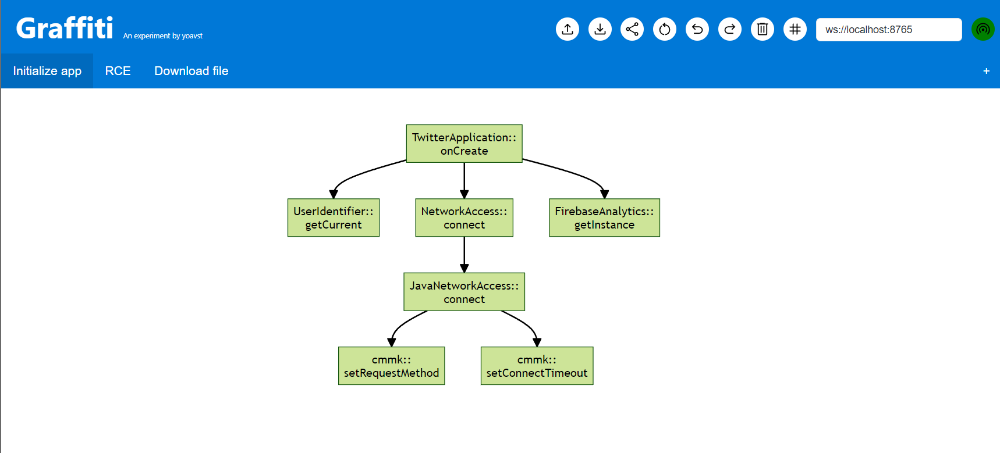

# Graffiti
Create customized callgraph directly from your favorite IDE.




## Features
* Add a node to the callgraph directly from your IDE. Currently supports both JEB, Intellij and VSCode. You can select the parent node using a click.
* Switch the direction of the arrow directly from your IDE.
* Open the code of a node using right click
* Export the graph to mermaid 
* The graph support scrolling and zooming
* Auto save to localstorage
* Multiple tabs
* Alpha Visio support

## Setup
1. Run the python server
```python
pip3 install -r server/requirements.txt
python3 server/main.py
```
2. copy the jeb scripts into JEB_INSTALLATION/scripts, and reload JEB.
3. start a localhost server from web dir:
```bash
cd web
python3 -m http.server 80
```
4. From your web, enter http://localhost . Press connect to connect to the python server. The button will be green if successfully connected.

### JEB
Run the script graphPull.py to connect JEB to the server. Then, you can use the following shortcuts:

* Ctrl+Shift+A - add a new node and an edge
* Ctrl+Shift+X - add a new node and an edge with text on it
* Ctrl+Shift+Z - Change the direction for the arrows

### Intellij - Alpha
Install the Intellij Plugin. Then, in tools menu, enable graffiti sync.
Now, you can right click inside a function, and choose to add the current method to graffiti.

### VSCode - Alpha
Install the vscode plugin. Then, run the graffiti server command.
Now you can be inside a function, and run the graffiti add command.