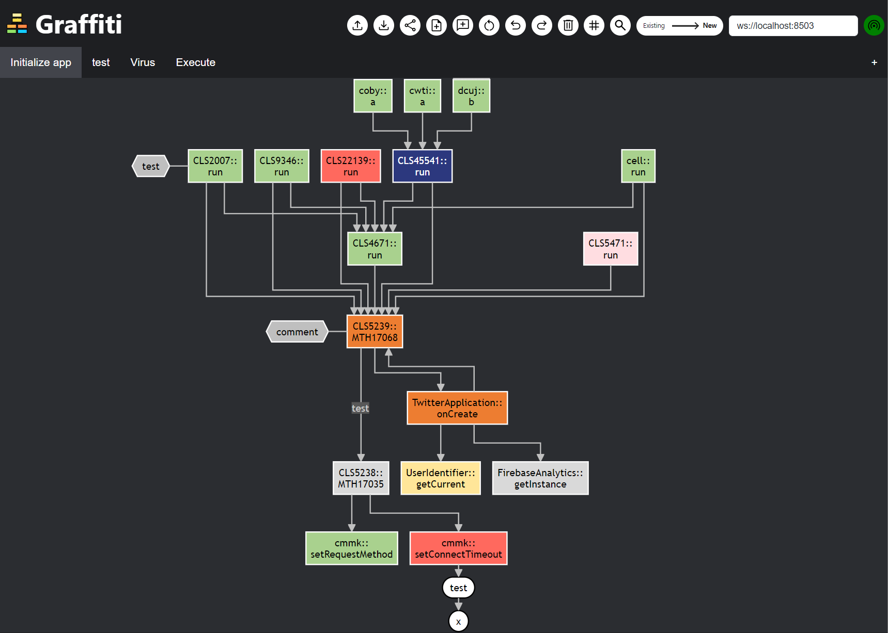
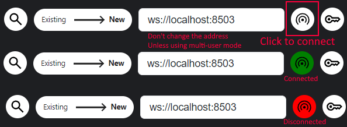
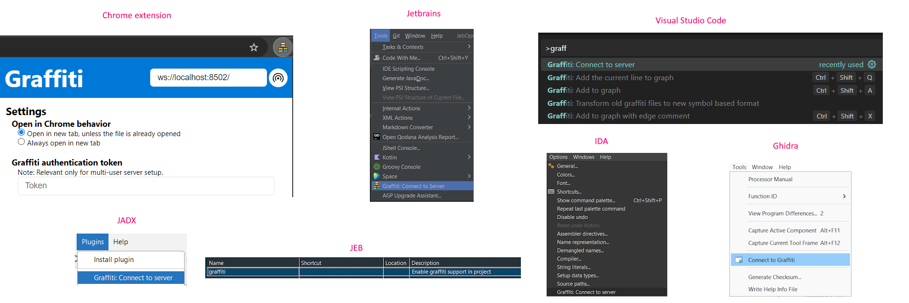
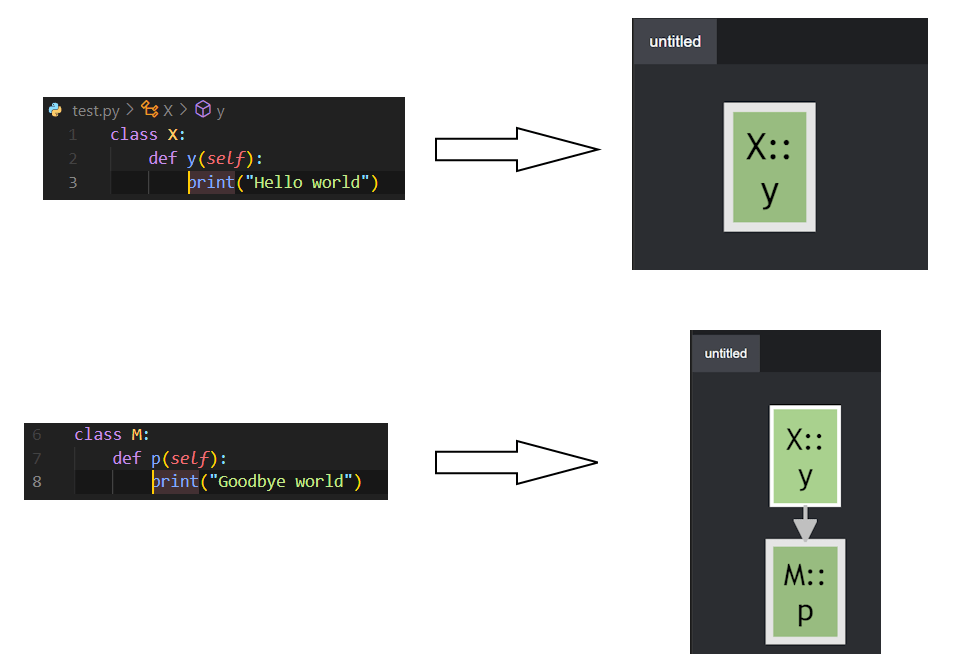
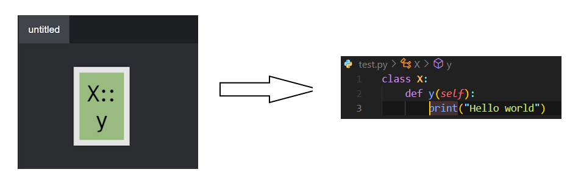
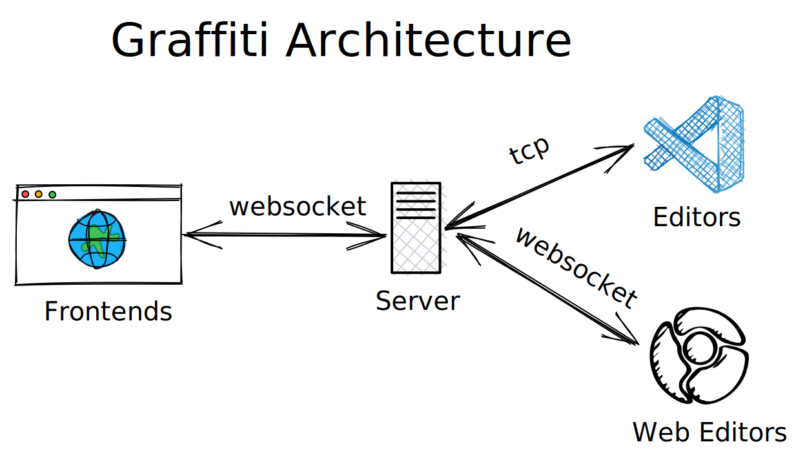

# Graffiti

Create customized callgraph directly from your favorite editor.



## Features

- Add a node to the callgraph directly from your editor.
- You choose what to add and where.
- Open the selected node in the editor using right click.
- Add text nodes, and comments
- Export the graph to mermaid, svg or png
- The graph support scrolling and zooming
- Auto save to localstorage, can export to file.
- Multiple tabs
- Rename in the editor? the change will propagate to the graph.

## Setup

The setup consits of three components: server, website, IDE Connect. See [Architecture section](#architecture) for more info.

1. **Server** - Download and run `server.pyz` using python3: `python3 server.pyz` .
2. **Website** - Open [graffiti.quest](https://graffiti.quest) in your browser.
   - You can also serve the files from `graffiti_frontend_web_with_deps.zip` with your favorite http server.
3. **IDE Connect** -
   - press `?` on the website to open the help screen.
   - Download the artifact for your chosen IDE.
   - Click the `Docs` button for your chosen IDE to see specific installation details.

Now you need the configure the website and the IDE plugin to connect through the server.

1. **Website** - Click the connect button on the top right of the screen. The background will change to green on successful attempt.  
   
2. **IDE** - Follow the explanation in the usage section of the `?` docs.  
   

## Usage

Graffiti represents a graph of entries from the code. The rule of thumb is:

> A new node will be added as a child of the currently selected node in the website

You can select a node in the graph by clicking on it. Pressing escape will unselect the node.

### Adding a new node

To add a node, go to your chosen IDE and position your cursor inside a function (or field in supported platforms).
Now, use the following shortcuts to add the current function to the graph

- Ctrl+Shift+A - Add a new node to the graph.
- Ctrl+Shift+X - Add a new node to the graph with a custom text on the edge.

In some of the IDEs we also support adding a line node - a node representing specific line in the source file/binary.  
Some IDEs also support adding all the xrefs of a symbol.



### Jumping to the source

If you right click on a node, it will open the symbol in your connected IDE.



### And much more

To learn about advance features of graffiti, use the `?` screen to read the docs of the Web UI. You can also you the command palette at `ctrl+shift+p` to explore all the available commands.

## Backends

| Editor      | Languages                               | add to graph | open in editor | Rename support | Field support | Add line to graph | Add xrefs | Socket type |
| ----------- | --------------------------------------- | ------------ | -------------- | -------------- | ------------- | ----------------- | --------- | ----------- |
| JEB         | Java                                    | ✅           | ✅             | ✅             | ✅            | ✅                | ✅        | TCP         |
| Intellij    | Java, Kotlin, Go, C, C++, PHP, Python   | ✅           | ✅             | ❌             | ✅            | ✅                | ✅        | TCP         |
| CLion       | C, C++                                  | ✅           | ✅             | ❌             | ✅            | ✅                | ✅        | TCP         |
| PHPStorm    | PHP                                     | ✅           | ✅             | ❌             | ✅            | ✅                | ✅        | TCP         |
| PyCharm     | Python                                  | ✅           | ✅             | ❌             | ✅            | ✅                | ✅        | TCP         |
| GoLand      | Go                                      | ✅           | ✅             | ❌             | ✅            | ✅                | ✅        | TCP         |
| VSCode      | Depends on available language server    | ✅           | ✅             | ❌             | ❌            | ✅                | ❌        | TCP         |
| IDA         | \*                                      | ✅           | ✅             | ✅             | -             | ✅                | ✅        | TCP         |
| Ghidra      | \*                                      | ✅           | ✅             | ✅             | -             | ✅                | ❌        | TCP         |
| Jadx        | Java                                    | ✅           | ✅             | ✅             | ✅            | ❌                | ✅        | TCP         |
| OpenGrok    | Java, C, C++, Go, Kotlin unless indexed | ✅           | ✅             | -              | ❌            | ✅                | ❌        | Websocket   |
| Sourcegraph | Java, C, C++, Go, Kotlin                | ✅           | ✅             | -              | ❌            | ✅                | ❌        | Websocket   |
| Github      | Java, C, C++, Go, Kotlin                | ✅           | ✅             | -              | ❌            | ✅                | ❌        | Websocket   |
| Gitlab      | Java, C, C++, Go, Kotlin                | ✅           | ✅             | -              | ❌            | ✅                | ❌        | Websocket   |

You can build all the backends using `make`, or build specific backend by running its own task.

Check [here](docs/platforms) for instructions for using graffiti on each supported platform

## Architecture


Graffiti was built with the following assumptions:

- You might use more than a single editor for a project.
- You might want to run everything locally.
- It should be easy to use.

Graffiti consists of 3 separate components

- **Backend** - the editor used to browse code. The editor might be native, therefore supporting TCP sockets. However, some editors are inside a browser (for example: OpenGrok). Chrome doesn't support TCP Sockets, so Backend should be able to communicate with WebSocket as well. Backend should implement the following functionality:
  - Add to graph - Send the current focused symbol.
  - Pull - Get a symbol's address from the socket and open it in the editor
  - (Optional) Rename - detect rename in the editor and notify the socket.
- **Frontend** - Shows the call graph and allow you to interact with it. Should support:
  - Layout the nodes
  - Navigating the graph
  - Import and export graph
  - Undo, Redo
  - etc...
- **Server** - A middleware between the backend and the frontend. Support multiple of them in the same time, by multiplexing all the requests.
  Need to support: - TCP editor connection - WebSocket editor connection - Websocket frontend connection

### Multi user support

Multi user support works by requiring each connected frontend/backend to supply a token.
A token represent the namespace of a single user. Messages from the same user will only be delievered to its components.

On the first time you try to connect to a multi-user server with any backend, it will ask you for the token to use. You can retreive it from the web frontend,
by clicking the key button on the top right of the screen. The frontend token is saved to localstorage so you can count it to remain the same.

To make it more user friendly, the backends cache the token under `~/.graffiti/token` on MacOS/Linux, `%USERPROFILE%/.graffiti/token` on Windows.

## Patches

### Mermaid

The project apply the following patch to support comments on the web frontend:

```diff
diff --git a/packages/mermaid/src/diagrams/flowchart/elk/flowRenderer-elk.js b/packages/mermaid/src/diagrams/flowchart/elk/flowRenderer-elk.js
index 5ed06723..dc0fde0e 100644
--- a/packages/mermaid/src/diagrams/flowchart/elk/flowRenderer-elk.js
+++ b/packages/mermaid/src/diagrams/flowchart/elk/flowRenderer-elk.js
@@ -902,6 +902,7 @@ export const draw = async function (text, id, _version, diagObj) {
   });

   insertChildren(graph.children, parentLookupDb);
+  if (window.elk_beforeCallback) window.elk_beforeCallback(id, graph)
   log.info('after layout', JSON.stringify(graph, null, 2));
   const g = await elk.layout(graph);
   drawNodes(0, 0, g.children, svg, subGraphsEl, diagObj, 0);
```

### NinjaKeys

The projects patches out the hotkey registeration of ninja keys, since it has a bug:

```diff
diff a/ninja-keys/src/ninja-keys.ts b/ninja-keys/src/ninja-keys.ts
--- a/ninja-keys/src/ninja-keys.ts
+++ b/ninja-keys/src/ninja-keys.ts
@@ -223,10 +223,0 @@ override update(changedProperties: PropertyValues<this>) {
-      this._flatData
-        .filter((action) => !!action.hotkey)
-        .forEach((action) => {
-          hotkeys(action.hotkey!, (event) => {
-            event.preventDefault();
-            if (action.handler) {
-              action.handler(action);
-            }
-          });
-        });
```

# Credits

The logo icons created by Freepik - Flaticon.
