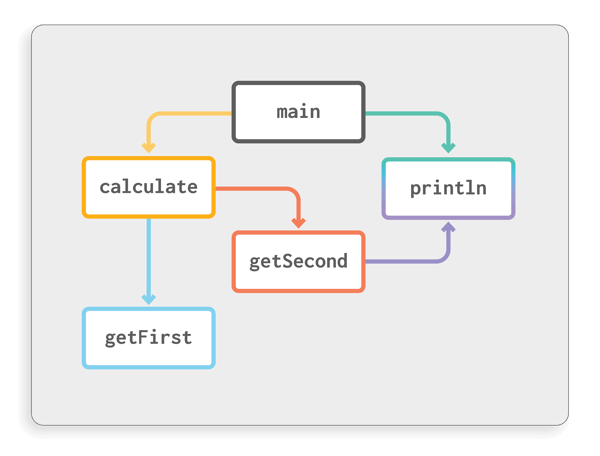
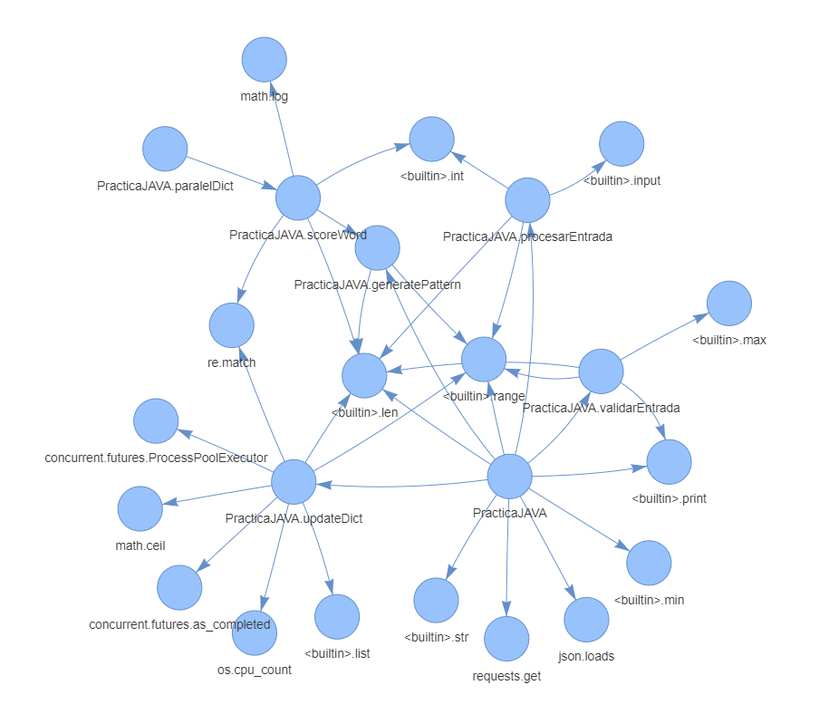
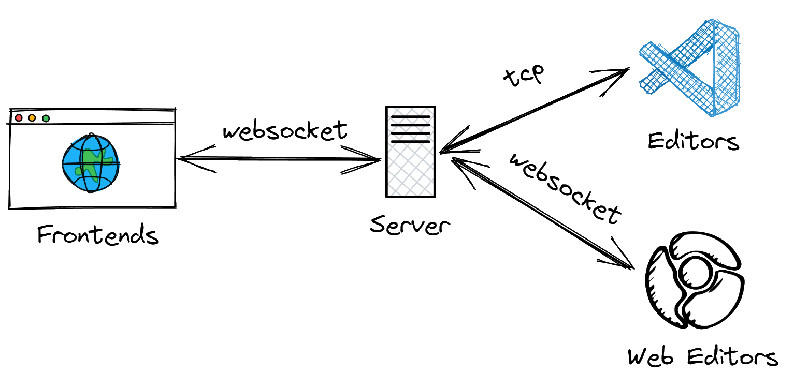

# **Graffiti**

Create custom callgraphs, directly from your Editor

---

# Why graphs?

- Graphs help to understand complex flows.
- They can serve as great documentation tool.
- Graphs contains less distractions then a (possibly obfuscated) code.

---

# Why Not graphs?

- Creating a good, informative graph requires time and effort.
- on the contrary, automatically generated call-graphs are usually bloated, containing a lot of unimportant calls.
- There is no standard, so it's hard to share them with colleagues.

---

# Graffiti

What if you could create a graph directly from your editor?

- You don't have to layout the nodes.
- Clicking on the node would open them in the edior.
- Renamed the method? It will be updated on the graph.
- Can be exported to mermaid.

---

# Architecture

- **Frontend** - Shows the graph.
- **Server** - Multiplex between the frontend and editors.

---

# Supported editors

| Editor   | Languages                            | Rename support |
| -------- | ------------------------------------ | -------------- |
| JEB      | Java                                 | ✅             |
| Intellij | Java, Kotlin                         | ❌             |
| VSCode   | Depends on available language server | ❌             |
| OpenGrok | \*                                   | ❌             |
| IDA      | \*                                   | ✅             |

---

---

# **Demo**
